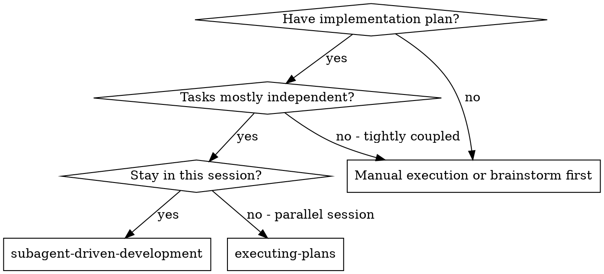
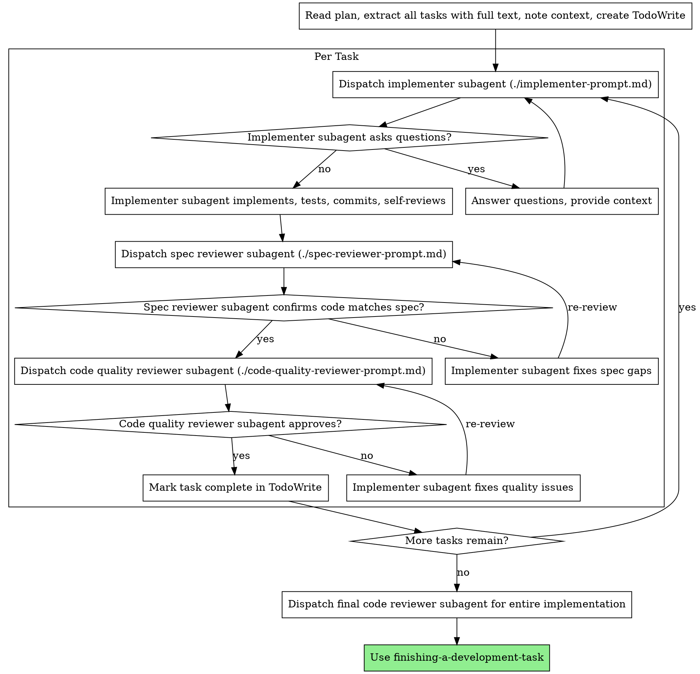

# Subagent-Driven Development

Execute a plan by dispatching a fresh subagent per task, with two-stage review after each: spec compliance review first, then code quality review.

**Why subagents:** You delegate tasks to specialized agents with isolated context. By precisely crafting their instructions and context, you keep them focused and successful. They should never inherit your session's context or history — you construct exactly what they need. This also preserves your own context for coordination work.

**Core principle:** Fresh subagent per task + two-stage review (spec then quality) = high quality, fast iteration.

**Continuous execution:** Do not pause to check in between tasks. Execute all tasks from the plan without stopping. The only reasons to stop are: a BLOCKED status you cannot resolve, ambiguity that genuinely prevents progress, or all tasks complete. "Should I continue?" prompts and progress summaries waste the user's time — they asked you to execute the plan, so execute it.

## When to Use



**vs. Executing Plans (parallel session):**

- Same session (no context switch)
- Fresh subagent per task (no context pollution)
- Two-stage review after each task: spec compliance first, then code quality
- Faster iteration (no human-in-loop between tasks)

## The Process



## Model Selection

Use the least powerful model that can handle each role to conserve cost and increase speed.

**Mechanical implementation tasks** (isolated functions, clear specs, 1-2 files): use a fast, cheap model. Most implementation tasks are mechanical when the plan is well-specified.

**Integration and judgment tasks** (multi-file coordination, pattern matching, debugging): use a standard model.

**Architecture, design, and review tasks:** use the most capable available model.

**Task complexity signals:**

- Touches 1-2 files with a complete spec → cheap model
- Touches multiple files with integration concerns → standard model
- Requires design judgment or broad codebase understanding → most capable model

## Handling Implementer Status

Implementer subagents report one of four statuses. Handle each appropriately:

**DONE:** Proceed to spec compliance review.

**DONE_WITH_CONCERNS:** The implementer completed the work but flagged doubts. Read the concerns before proceeding. If they're about correctness or scope, address them before review. If they're observations (e.g., "this file is getting large"), note them and proceed to review.

**NEEDS_CONTEXT:** The implementer needs information that wasn't provided. Provide the missing context and re-dispatch.

**BLOCKED:** The implementer cannot complete the task. Assess the blocker:

1. If it's a context problem, provide more context and re-dispatch with the same model.
2. If the task requires more reasoning, re-dispatch with a more capable model.
3. If the task is too large, break it into smaller pieces.
4. If the plan itself is wrong, escalate to the human.

**Never** ignore an escalation or force the same model to retry without changes. If the implementer said it's stuck, something needs to change.

## Prompt Templates

- `./implementer-prompt.md` — dispatch implementer subagent
- `./spec-reviewer-prompt.md` — dispatch spec compliance reviewer subagent
- `./code-quality-reviewer-prompt.md` — dispatch code quality reviewer subagent

## Example Workflow

```
You: I'm using Subagent-Driven Development to execute this plan.

[Read plan file once]
[Extract all tasks with full text and context]
[Create TodoWrite with all tasks]

Task 1: Hook installation script

[Dispatch implementation subagent with full task text + context]

Implementer: "Before I begin - should the hook be installed at user or system level?"
You: "User level (~/.config/superpowers/hooks/)"
Implementer: "Got it. Implementing now..."
[Later] Implementer:
  - Implemented install-hook command
  - Added tests, 5/5 passing
  - Self-review: Found I missed --force flag, added it
  - Committed

[Dispatch spec compliance reviewer]
Spec reviewer: Spec compliant - all requirements met, nothing extra

[Dispatch code quality reviewer]
Code reviewer: Strengths: Good test coverage, clean. Issues: None. Approved.

[Mark Task 1 complete]

Task 2: Recovery modes
...

[After all tasks]
[Dispatch final code-reviewer]
Final reviewer: All requirements met, ready to finish

Done -> finishing-a-development-task
```

## Advantages

**vs. Manual execution:**

- Subagents follow TDD naturally
- Fresh context per task (no confusion)
- Parallel-safe (subagents don't interfere)
- Subagent can ask questions (before AND during work)

**vs. Executing Plans:**

- Same session (no handoff)
- Continuous progress (no waiting)
- Review checkpoints automatic

**Quality gates:**

- Self-review catches issues before handoff
- Two-stage review: spec compliance, then code quality
- Review loops ensure fixes actually work
- Spec compliance prevents over/under-building

## Red Flags

**Never:**

- Start implementation on `main`/`master` without explicit user consent
- Skip reviews (spec compliance OR code quality)
- Proceed with unfixed issues
- Dispatch multiple implementation subagents in parallel (conflicts)
- Make a subagent read the plan file (provide full text instead)
- Skip scene-setting context (the subagent needs to understand where the task fits)
- Ignore subagent questions (answer before letting them proceed)
- Accept "close enough" on spec compliance
- Start code quality review before spec compliance passes (wrong order)
- Move to the next task while either review has open issues

**If a subagent asks questions:** answer clearly and completely; provide context; don't rush them into implementation.

**If a reviewer finds issues:** the same implementer subagent fixes them, then the reviewer reviews again. Repeat until approved.

**If a subagent fails a task:** dispatch a fix subagent with specific instructions. Don't fix manually (context pollution).

## Integration

**Related workflow skills (in this collection):**

- **write-plan** — creates the phase-based plan this skill executes.
- **requesting-code-review** — the code review template the reviewer subagents use.
- **finishing-a-development-task** — completes development after all tasks are done.
- **executing-plans** — parallel-session alternative to same-session execution.

**Subagents should use:**

- **test-driven-development** — subagents follow TDD for each task.
