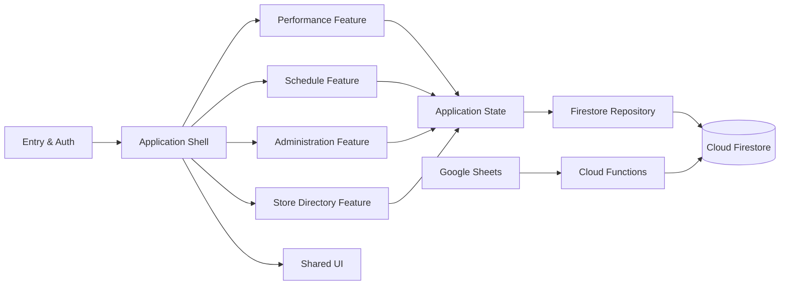

# Montana PQH Team — System Design

**Status:** Implemented

**Last updated:** July 10, 2026

**Scope:** Refactor the Montana PQH Team PWA into clear frontend and backend modules without changing its existing user-facing behavior or Firebase contracts.

## 1. Abstract

Montana PQH Team is a React PWA for five Montana stores. It supports a local demo, Google/Firebase live access, employee performance tracking, monthly goals, milestones, schedules, a store directory, and management views. The client previously centralized application state, routing, layout, and all screens in a single `src/App.tsx`, which made changes difficult to review and test.

The client now lives in its own `app/` package (`app/src/`), separate from the `functions/` backend and root-level Firebase configuration. It is split into an application shell (`app/src/app/`), framework-free domain logic and types (`app/src/domain/`), seed/config data (`app/src/data/`), infrastructure services (`app/src/services/`), shared UI (`app/src/shared/`), and one feature module per screen group (`app/src/features/{performance,schedule,administration,stores}/`), each exposing components one-per-file behind an `index.ts` barrel. Firebase, Firestore collections, Cloud Functions, schedule contracts, and PWA behavior are unchanged.

## 2. Goals and Non-Goals

### Goals

- Reduce `App.tsx` to composition, entry-mode routing, and feature wiring.
- Give every feature an explicit public interface and focused ownership boundary.
- Preserve existing routes, demo behavior, Firestore document shapes, roles, and schedule-sync behavior.
- Keep pure business logic independently testable with Vitest.

### Non-Goals

- Replacing Firebase, Firestore, or the Google Sheets integration.
- Changing performance metrics, role permissions, or visual brand direction.
- Introducing a third-party routing or state-management library.
- Changing deployed data contracts as part of the refactor.

## 3. Background and Problem Statement

`src/App.tsx` currently contains entry handling, local/demo persistence, live-data mutation dispatch, navigation, layout, and every page implementation. This couples unrelated features and forces any screen-level change through a large file. The repository and schedule utilities are already separate and establish the preferred direction: typed, focused modules with explicit inputs and outputs.

The refactor boundary is the client. The backend remains split between daily-summary/audit functions and schedule reconciliation, with Firestore as the system of record for live app state.

## 4. Proposed Architecture

| Component | Responsibility | Primary storage | Failure behavior |
|---|---|---|---|
| Entry & Auth | Welcome, demo/live selection, Google sign-in, onboarding gates | Browser memory, Firebase Auth | Demo stays usable when Firebase is absent; live mode reports sign-in errors. |
| Application state | Selects demo or live state and maps UI updates to repository operations | Browser storage for demo; Firestore for live | Live writes fail without mutating the demo path. |
| Performance feature | Daily entries, goals, milestones, dashboard, leaderboard | Firestore `dailyEntries`, `monthlyGoals` | Read-only/pending UI is shown when role/status blocks work. |
| Schedule feature | My schedule, store schedule, open status, calendar export | Firestore `scheduleShifts`, `scheduleNotifications` | Cached/local data remains visible where Firestore persistence permits. |
| Administration feature | Profiles and employee management | Firestore `users`, `stores` | Firestore rules remain the authorization boundary. |
| Store Directory feature | Call/map/message stores, live open status, store-manager contact edits | Firestore `stores` | Store managers may edit only their own store; area managers edit any store. |
| Cloud Functions | Audit, monthly summaries, Google Sheet reconciliation | Firestore and Functions secrets | Invalid Sheet rows create a failed sync run rather than partial schedule updates. |

## 5. Request Lifecycle

1. The client opens on Welcome and the user chooses Demo or Live.
2. Demo uses browser state only; Live authenticates with Google and loads the user profile.
3. The application-state module subscribes to role-scoped Firestore data through the repository.
4. A feature receives typed state and callbacks, renders its view, and requests a domain update.
5. The application-state module sends the appropriate repository write; Firestore snapshots refresh subscribed views.
6. Cloud Functions audit daily changes, rebuild summaries, and reconcile the schedule every 15 minutes.

## 6. API and Data Contracts

| Contract | Source of truth | Key guarantee |
|---|---|---|
| `UserProfile` | `users/{uid}` | UID, role, status, and store scope determine allowed client reads/writes. |
| `DailyEntry` | `dailyEntries/{employeeId_date}` | Entries use the existing metric record and audit trail. |
| `MonthlyGoal` | `monthlyGoals/{employeeId_month}` | Goals remain employee/month scoped. |
| `ScheduleShift` | `scheduleShifts/{shiftId}` | Sheet row identity remains the shift identity. |
| `ScheduleNotification` | `scheduleNotifications/{notificationId}` | Reconciliation creates added, changed, and removed notices. |
| Schedule spreadsheet | `App Schedule!A:I` | The nine existing required headers remain required. |

## 7. Consistency, Idempotency, and Replay

- Daily entries use stable employee/date IDs, so repeated save operations update one record.
- Schedule reconciliation compares source hashes, upserts only changed rows, and deletes no-longer-published shifts.
- Invalid schedule rows stop a run and create a failed sync record instead of applying a partial import.
- The client treats Firestore snapshots as authoritative for live mode; demo state is intentionally separate.

## 8. Security and Privacy Considerations

- Firebase Authentication establishes identity; Firestore rules enforce employee, store-manager, and area-manager boundaries.
- The browser receives only Firebase application configuration. The Google Sheets service-account credential remains a Firebase Functions secret.
- The client stores contact details only in the profile record already used by the app. No customer/account data is introduced by this refactor.

## 9. Operational Readiness

| Signal | Launch gate |
|---|---|
| Client test suite | Required: all Vitest tests pass. |
| Client production build | Required: TypeScript and Vite build pass. |
| Functions build | Required: Functions TypeScript build passes. |
| Schedule sync run | Required before live schedule rollout: a successful Sheet reconciliation is recorded. |
| Firebase rules | Required before production: Emulator verification of role boundaries. |

## 10. Alternatives Considered

| Alternative | Why not selected |
|---|---|
| Keep one `App.tsx` | Maintains tight coupling and makes feature-level testing/review harder. |
| Adopt Redux or another state library | Adds a new dependency without addressing the current file-boundary problem. |
| Route-based code splitting first | Useful later for bundle size, but it should follow clear feature boundaries. |

## 11. Open Questions

- Whether employee pre-enrollment should use an invite workflow before the employee completes Google onboarding.
- ~~Whether the production build warning should be addressed with route-level code splitting after this refactor.~~ Resolved: the Firebase SDK (`firebase/app`, `firebase/auth`, `firebase/firestore`, ~700KB) is now loaded via dynamic `import()` behind `loadFirebase()`, so it ships only to sessions that actually enter live mode. The initial bundle dropped from ~884KB to ~249KB.
- Which organization owns Firebase project provisioning and production monitoring.
- The `firestore.rules` emulator test suite listed as a launch gate in Section 9 still does not exist; the `stores/{storeId}` rule was tightened (store managers get `update` only, not `create`/`delete`) without automated coverage. Adding `@firebase/rules-unit-testing` + emulator-backed tests remains outstanding.

## 12. Decision and Next Steps

Adopt feature-based modules with a thin application shell. First extract shared UI and entry/state handling, then move performance, schedule, and administration screens without changing public behavior. Verify the existing test suite and builds after each feature move before splitting the next feature.

This is complete: the client lives in `app/` as a layered module tree, `App.tsx` is reduced to entry-mode gating and composition (`AppShell` for chrome, `AppRouter` for page wiring), and the Vitest suite plus `tsc -b`/`vite build` gate every change.
